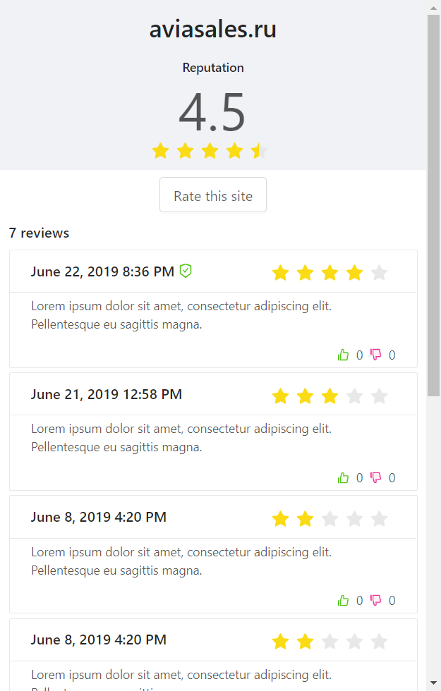

# Blockchain-based site reviews Chrome extension



## How to run

- Run script

```bash
# build files to './dev'
# start webpack development server
$ npm run dev
```

- [Load unpacked extensions](https://developer.chrome.com/extensions/getstarted#unpacked) with `./dev` folder.

### For production:

```bash
# compress build folder to {manifest.name}.zip and crx
$ npm run build
$ npm run compress
```

## Build with

- [react-chrome-extension-boilerplate](https://github.com/jhen0409/react-chrome-extension-boilerplate) - Boilerplate for Chrome Extension React.js project

## Arweave

Default address is -uUlJ3b5YiY06C99aPBogOkxpECXMgkhm45ZugrdyHk
Keyfile is loacated in keyfiles/example.json
Passphrase is 12345678

Tx example: http://arweave.net/tx/CMUFSPIakmNfjWXmWlAbRZxJCTX5c-lMVcCc8x-QZgc

## Fluence

ETH address is 0x3B3AC9B65c2f9602865f0E6d8EEcD468920938f7

How to work with it?

```javascript
let contract = '0xeFF91455de6D4CF57C141bD8bF819E5f873c1A01'; // Fluence contract address
let appId = 252; // Deployed database id
let ethereumUrl = 'http://geth.fluence.one:8545'; // Ethereum light node URL

// Connect to your app
fluence.connect(contract, appId, ethereumUrl).then((s) => {
  console.log('Session created');
  window.session = s;
});
```

```javascript
// Send a request
session.request('SET A 10');

// Send a request, and read its result
session
  .request('GET A')
  .result()
  .then((r) => {
    console.log('Result: ' + r.asString());
  });
```

## Contributors ✨

This project is part of [Decentralized Web Hackathon](https://web3hack.dev/), sponsored by [fluence](http://fluence.network/) and [arweave](http://arweave.org/) (Jun 22-23 2019, Minsk, Belarus).

<!-- ALL-CONTRIBUTORS-LIST:START - Do not remove or modify this section -->
<!-- prettier-ignore -->
<table>
  <tr>
    <td align="center"><a href="https://savin.dev"><br /><sub><b>Yury Savin</b></sub></a><br /><a href="https://github.com/baitun/VoteEX/commits?author=baitun" title="Code">💻</a></td>
    <td align="center"><a href="https://github.com/execc"><br /><sub><b>execc</b></sub></a><br /><a href="https://github.com/baitun/VoteEX/commits?author=execc" title="Code">💻</a> <a href="#talk-execc" title="Talks">📢</a></td>
    <td align="center"><a href="http://easychain.tech"><br /><sub><b>Yuliya Palamarchuk</b></sub></a><br /><a href="#ideas-JulyElektra" title="Ideas, Planning, & Feedback">🤔</a></td>
    <td align="center"><a href="https://github.com/AndreKuren"><br /><sub><b>AndreKuren</b></sub></a><br /><a href="#ideas-AndreKuren" title="Ideas, Planning, & Feedback">🤔</a></td>
  </tr>
</table>

<!-- ALL-CONTRIBUTORS-LIST:END -->

This project follows the [all-contributors](https://github.com/all-contributors/all-contributors) specification. Contributions of any kind welcome! If you have any questions, feel free to contact me via telegram: https://t.me/savinyurii
